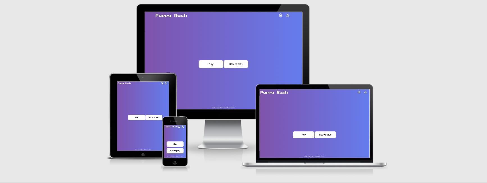

# Puppy Rush

## Table of contents

1.[UX](#ux)

* [User Stories](#user-stories)

2.[Structure](#structure)

* [Design process](#design-process)

  * [Page structure](#page-structure)
  * [Home page](#home-page)
  * [Recipes page](#recipes-page)
  * [Contact page](#contact-page)

3.[Styling](#styling)

* [Colours](#colours)
* [Fonts](#fonts)
* [Features](#features)

  * [Existing features](#existing-features)
  * [Future features](#future-features)

4.[Technologies used](#technologies-used)

* [Languages](#languages)
* [Libraries](#libraries)
* [Tools](#tools)

5.[Testing](#testing)

* [Testing responsiveness](#testing-responsiveness)
* [Browsers](#browsers)
* [HTML and CSS validation](#html-and-css-validation)
* [Tools for testing](#tools-for-testing)

6.[Tests](#tests)

* [Bugs found and fixed](#user-stories)
* [Deployment](#deployment)

7.[Credits](#credits)

* [Content](#content)
* [Media](#media)
* [Acknowledgements](#acknowledgements)
* [I received advice and support from](#user-stories)

## UX

### User stories

**As a user I would like to**: |  **So that I could**: |
| ------------- |:-------------:|
| Easily understand the purpose of the page | Learn how to play and play the game|
| Use an aesthetically pleasing site| enjoy my user experience |
| Easily navigate the site| Quickly find what I need |
| Find features that load quickly | Save time |
| Play the game in different screen sizes | I can use different devices |
| Be able to find easily the contact information  | I can send a message easily |
| Be able to contact the site owner | I can communicate with them |

### Site owner objectives

**As the site owner I would like to**: |  **So that the users**: |
| ------------- |:-------------:|
| Offer an site that is easy to navigate | Can enjoy the game|
| Use an aesthetically pleasing site| Have an easy experience |
| Provide an easy way to contact me| Give feedback or ask questions |

The wireframes for this project for desktop, iPad and mobile can be find [here](https://github.com/CarolinaCobo/puppy-rush/tree/main/assets/wireframes).

## Structure

### Design process

#### Page structure

* My aim was to make the game simple and easy for the user to play it.
* All pages follow the same style and color palette, simple and easy to navigate.
* The navbar on top of the page is static and have the icons linked to the main site and the contact site. It also has the logo. It's responsive on smaller devices.
* The home page has two buttons one to play that will take the user to that side of the games and a "How to play" one that opens a modal to view the instructions.
* The game site has the navbar, a score section, as well as the game grid with the puppies.

### Home page

Single page with the navigation bar with a home and a contact button on the top and two buttons in the middle of the page, one to open the game and another one to read the instructions.
This page is a modal that is covering the game until the users press the "Play" button.

### Game page

This page has a modal on top of it that disappears once the "Play" button is clicked. It is a square with random puppies that has to be grouped in 3 or 4 of the same type to disappear. Once they disappear, some new appears from the top of the page and the score sections is updated.

On top of the page the user can find two buttons to reload the home page or go to the contact page.

### Contact page

The contact page has three boxes with name, email, question and button to submit a question. Once the question is submitted an alert will open showing that the message was sent.

## Styling

### Colours

Using [Colorhunt.co](https://colorhunt.co) I chose a palette with complementary colours that could be found in different sites:

*  `#fff` - h1, background in the instructions, score, footer.
* Gradient from the right of  `#7f53ac` and  `#657ced` - Background of the page and the modal.
*  `#c7a1f5` - Icons and buttons hover on the icons.
*  `#ccc` - Border of the button elements.
*  `#ffffff` - Game board background color.  

### Fonts

For the logo and the Score I used  "Press Start 2P" and for the rest of the site "Poppins". Both imported from Google fonts. Used on the Universal selector to format the entire site.

### Favicon

I used as Favicon one of the images used for the game. I converted it using Favicon.io.

### Features

#### Existing Features

* Feature 1 - Landing page with two buttons that allows the user to pick between two options Play or How to Play.
* Feature 2 - Modal that covers the game.
  * Built with HTML, CSS and JS the modal disappears and let the user play the game.
  * Pressing the play button set the score to 0 as well.

* Feature 3 - Allows the user to click on "How to Play".
  * Built with HTML, CSS and JS once the button is clicked a modal appears with the instructions of how to play the game.

* Feature 4 - Two buttons on the top of the page, one to return to the main page and another to go to the contact page.
  * The buttons are SVG images and link with the Home page and contact page.

* Feature 4 - Allows users to send a message with a question.
  * Built with HTML, CSS and JS and used EmailJS API to send a message to the site owner.

#### Future features

* Timer.
* Score board with a ranking of players.

### Technologies Used

#### Languages

* HTML -  to build the structure of this site.
* CSS - to style and fix media queries and the max width.
* JavaScript - to build the game and add interactivity with buttons and send messages to the site owner.

#### Libraries

* [Google Fonts](https://fonts.google.com) - used for fonts on the site.
* [Hover.css](https://ianlunn.github.io/Hover/) - used for animation effects on social icons and various buttons throughout the site.
* [Google Fonts](https://fonts.google.com/) - Import the fonts used ont he site.
* [Hero Icons](https://heroicons.com/) - Site icons.
* [TailwindCSS](https://tailwindcss.com/docs/box-shadow) - For inspiration on the styles for the site.

#### Programmes and Tools

* VSCode - used as IDE for the project.
* [Git](https://git-scm.com/) - used for version control.
* [Github](https://github.com/) - used to host repository and to generate the live website.
* Balsamiq - used to create the wireframes.
* [Chrome Developer Tools](https://developers.google.com/web/tools/chrome-devtools) - used to test and optimize the site.

### Testing

#### Code Validity

Code has tested and passed all the test at:

* [W3C Markup Validation Service - HTML](https://validator.w3.org/).
* [W3C Markup Validation Service - CSS](https://jigsaw.w3.org/css-validator/).

* Screenshots following this [link](https://github.com/CarolinaCobo/puppy-rush/tree/main/assets/testing).

#### Testing responsiveness

* With Google Developer Tools in Chrome in all screen sizes.

#### Browsers

Manually tested:

* Chrome.
* Safari.

Tested on the following devices:

* MacBook Pro.
* HP.
* iPhone XS.
* Samsung.
* iPad.

Tested in desktop, phone and tablet sizes.

#### Tools for testing

* [Am I Responsive](http://ami.responsivedesign.is/) - for testing purposes.
* [Google Chrome DevTools](https://developers.google.com/web/tools/chrome-devtools) - used for testing and debugging.
* [w3 html validator](https://validator.w3.org/) - used to test and validate my html code.
* [w3 css validator](https://jigsaw.w3.org/) - used to test and validate my CSS code.
* JS Linter.

## Tests

The following manual tests have been performed, link video at the end.

1. Clicking all the buttons:
    1. Click Play and how to play.
    2. Click on the Home and Contact icons.

2. Game:
    1. Open it clicking the button.
    2. Matching the puppies to make them disappear.
    3. Checking that the score is updating.

3. Contact form:
    1. Go to the "Contact" page
    2. Try to submit the empty form and verify that an error message about the required fields appears
    3. Try to submit the form with an invalid email address and verify that a relevant error message appears
    4. Try to submit the form with all inputs valid and verify that a success message appears.
    5. An alert appears showing that the message has been sent.
    6. Click home button and come back to home page.

Below a table with a list of the test performed:

What do you do? | Expected Behavior | Pass/Fail  |
| ------------- |-------------| -----|
| Click the play button| Start game | Pass |
| Click How to Play button | Opens modal with the instructions | Pass |
| Click on the Contact icon on the top | Open the contact page | Pass |
| Play the game | Move the puppies on the grid | Pass |
| Play the game | Score starts on 0 | Pass |
| Play the game | Puppies disappear when 3 of them match | Pass |
| Play the game | Puppies disappear when 4 of them match | Pass |
| Play the game | Score updates when  puppies matched | Pass |
| Contact the site owner | Prompt an alert if the name is missing | Pass |
| Contact the site owner | Prompt an alert if the email is missing | Pass |
| Contact the site owner | Prompt an alert if the email format is incorrect | Pass |
| Contact the site owner | Prompt an alert if the message format is incorrect | Pass |
| Contact the site owner | Prompt an alert that the message has been sent | Pass |

Video testing the site in the following [link](https://www.loom.com/share/4cd9b9f3ad864e229848f7b6f35b7d50).

### Bugs found and fixed

* The score was starting with random numbers as anytime the game loaded it matched some of the puppies and disappeared. To fix that I added the modal and linked the play button in the modal with the event to reset the score on the JS file.
* Overflow in small devices, to fix this I added an overflow hidden and made different media queries for all screen sizes.
* Modal was pushing the game down instead of covering it, to fix it I put a wrapper around the content.
* Buttons not appearing on the right place and appearing below, fixed it by adding negative margin to move it up.
* Test reported an error because an anchor tag was wrapping the button with the image icon. To fix that I included a onclick event that would redirect to the desired site.
* Some semicolons were missing on the Game JS file.
* The test reported an error on the score was initially an h3 but as it was empty I modify it using a p tag instead, modifiying the styles on the CSS file as well.  

### Deployment

#### GitHub pages

My site is hosted on GitHub pages, deployed directly from the master branch.
The steps to complete the hosting process.

1. Log into GitHub.
2. Pick the repository.
3. Go to settings.
4. Scroll down to GitHub Pages section.
5. Select as a source "master branch".
6. The page refreshes automatically and the project is deployed.
7. The URL for the page will be public automatically.

#### Cloning

To run this code locally, you can clone this repository directly into the editor of your choice by following the steps below:

1. Open Terminal.
2. Change the current working directory to the location when you want the cloned directory.
3. Type the following into your Terminal:
git clone [https://github.com/CarolinaCobo/puppy-rush.git]
5.Press Enter to create a local clone.

To cut ties with this GitHub repository, type git remote rm origin into the terminal.
For more information regarding cloning of a repository click [here](https://help.github.com/en/github/creating-cloning-and-archiving-repositories/cloning-a-repository).

### Credits

#### Content

This project JS part was following Ania Kubow tutorial in how to build a Candy Crush style game. I made some changes on the game and built the CSS and HTML pulling information from different sites referenced below in the acknowledgements.

#### Media

* The color palette used in this site was obtained from [Colorhunt.co](https://colorhunt.co)
* The favicon for this site has been resized in [Favicon.io](https://favicon.io/)
* The Library Tailwind has been used for inspiration on styles.
* Icons are from [Hero Icons](https://heroicons.com/).
* The icons have been made for this project by a designer.

#### Acknowledgements

I received inspiration for this project from:

* [Ania Kubow](https://www.youtube.com/channel/UC5DNytAJ6_FISueUfzZCVsw)
* [MDN Documentation](https://developer.mozilla.org/en-US/)
* [W3Schools](https://www.w3schools.com/)
* [CSS-Tricks](https://css-tricks.com/)
* [StackOverflow](https://stackoverflow.com/)
* [Codú Community](https://www.youtube.com/channel/UCvI5azOD4eDumpshr00EfIw)
* [FreeCodeCamp](https://www.freecodecamp.org/)

#### I received advice and support from

* Codú Community.
* My mentor Dick Vlaanderen.
* Code Institute - Slack Community.
