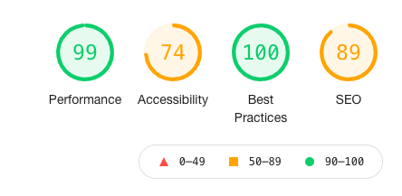
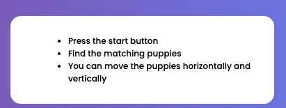
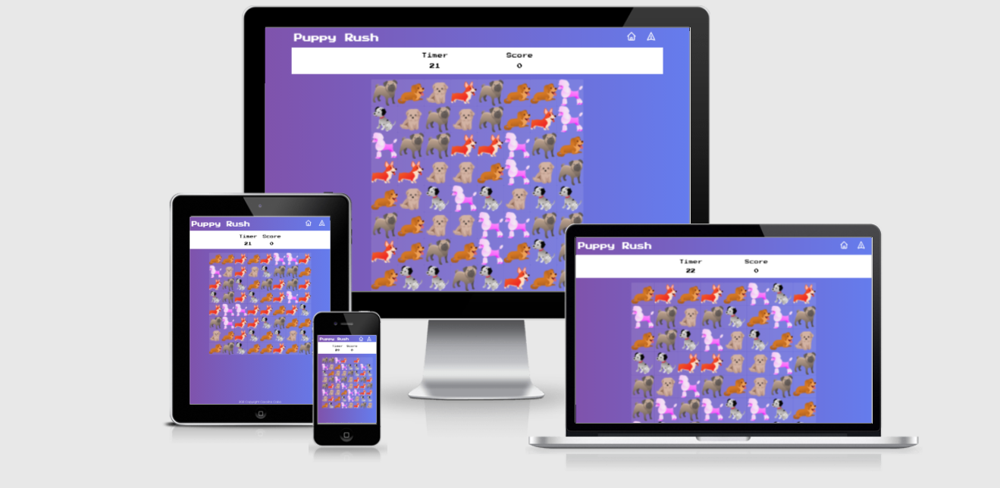
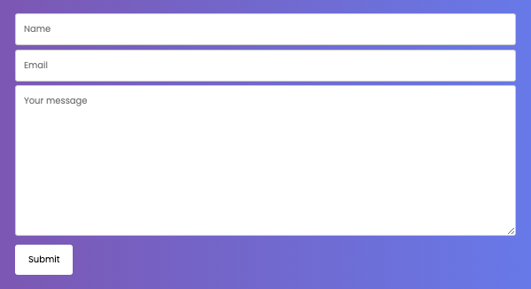
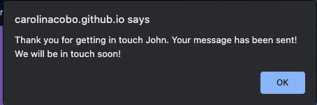
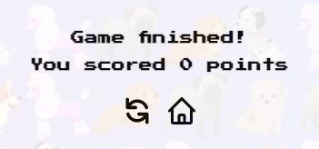

# Puppy Rush Testing

1.[Code validation](#code-validation)

2.[Other tools used](#other-tools-used)

3.[User Stories](#user-stories)

- [User Stories Paths](#user-stories-paths)
- [Testing user stories](#testing-user-stories)

3.[Manual Testing](#manual-testing)

- [Home page](#home-page)
- [Game page](#home-page)
- [Contact page](#home-page)
- [Test recording](#test-recording)
- [Devices and browsers](#devices-and-browsers)

5.[Bugs](#bugs)

- [Bugs Fixed During Testing](#bugs-fixed-during-testing)
- [Bugs found and not fixed](#bugs-found-and-not-fixed)

***  

Main [README.md](README.md) file.  

[Live site](https://carolinacobo.github.io/puppy-rush/) on Github Pages.  

***

## Code validation

- Both HTML and CSS code has been validated in [W3C CSS validation](https://jigsaw.w3.org/css-validator/) and [W3C Markup Validation](https://validator.w3.org/) to check the validity of the website code. In the following links a screenshot of the passed tests
  - [HTML](assets/testing/html-test.png)
  - [CSS](assets/testing/css-test.png)

- [Jshint](https://jshint.com/) Links to the result of the performed test below:
  - [Game.js](assets/testing/js-hint-game.png)
  - [Contact](assets/testing/js-hint-contactForm.png)

Some bugs were found and fixed, this will be explained in the bugs section below.

## Other tools used

- [Am I Responsive](http://ami.responsivedesign.is/) - test the game in different sizes.  
  - [Responsive](assets/testing/responsive-screens.png)
  - [Game responsive](assets/testing/responsive-game-screens.png)

- [Google Chrome DevTools](https://developers.google.com/web/tools/chrome-devtools) - used for testing and debugging along the development process.

- [Lighthouse](https://chrome.google.com/webstore/detail/lighthouse/blipmdconlkpinefehnmjammfjpmpbjk?hl=en)

    Lighthouse is an open-source, automated tool for improving the performance, quality, and correctness of your web apps. When auditing a page, Lighthouse runs a barrage of tests against the page, and then generates a report on how well the page did. From here you can use the failing tests as indicators on what you can do to improve your app.

    

## User Stories

### Testing user stories

1. As a new user I want to easily understand the purpose of the page.
    - The site is simple with the logo on the top left and two buttons one to access the game and another one to learn how to play.
    - Also the navbar has two icons that are commonly used in games to go to the Home page and the Contact page.
        

2. As a new user of the website, I want to find an aesthetically pleasing site.
    - A clearly labelled buttons to play and how to play are proportioned. The buttons on the navigation bar are the ones traditionally used on games.

        

3. As a new user, I want have instructions to play the game.
    - A modal will open and show the instructions if the user clicks on the How To Play Button.

        

4. As a new user, I want to easily play the game in different screen sizes.
    - The game works in different screen sizes as shown above. There's a bug that elaborated below as the game can't be played on touch screens.
    

5. As a new user, I want to be able to find easily the contact information.
    - The contact button can be accessed from all the pages Home page, game page and Contact page.

6. As a new user, I want to be able to contact the site owner.
    - Form that requires the user to input data to be able to submit and that shows an alert to let the user know that the message has been sent.

        

    - Once the message has been sent the user will get an alert including their name to confirm that the message has been sent and received by the site owner.

        

7. As a user I would like to have a timer to play so I can improve my score having the same time to play.
    - The time allocated is 30 second and the user will see the score in the modal at the end of the game.

        

8. As a user I would to easily replay the game after finish it.
    - The user has a replay button from the game over modal. After clicking it the timer and the score will restart.

        

## Manual testing

Manual testing is a process in which test cases are executed manually without using any automated tool. All test cases are executed manually according to the user stories to make sure the application is working.

### Home Page

1. Navigation bar:
    1. Go to the "Home" page from a desktop.
    2. Change the screen size from desktop to tablet to verify that the navigation bar and the buttons go to the right place.
        - _During the testing process another media query had to be added as the buttons were not in the right place in smaller screens._
    3. Click on each navigation menu item and verify that it links to the correct page.
    4. Hover over the Play, How to play buttons and Home and contact icons.
    5. Repeat verification of functionality and responsiveness on my mobile phone and tablet.

2. How to Play modal
    1. Click on it on different devices.
    2. Open it and close it when clicking anywhere else on the page.
        - _During the testing process another media query had to be added as the modal were not in the right place in smaller screens._

3. Review all functionality and responsiveness on my mobile devices and iPad.

### Game page

1. Navigation bar:
    1. As the game page was covered by a modal all the testing in the previous step is applicable for this page as well.

2. Play the game:
    1. Match 3 of the same kind of puppy, they disappear and more fall from the top of the grid.
    2. Match 4 of the same kind of puppy, they disappear and more fall from the top of the grid.
    3. Move the puppies around.

3. Game is responsive:
    1. The game size changes depending on the screen size.
        - _The size of the puppies had to be recalculated and another media query had to be added as during testing process as it was not the proper size in different screens_

4. Scoreboard update when the puppies are matched:
    1. Check that the scoreboard is at 0 anytime the game starts.
         - _This one was one of the biggest bugs encountered as the game was starting at a random number depending on how the puppies were randomly created. To fix that I added a modal on top of the game and linked the Play button with a set to score to 0 so anytime the user click on the play button the counter goes to zero, if the user goes back to the home page it will be again back to 0._

    2. Check that scoreboard is correctly update when the puppies match.

5. Game over:
    1. Game modal appears when the timer finishes the 30 seconds time allocated.
    2. It's possible to restart the game from the modal.
    3. It's possible to view the score in the modal.
    4. It's possible to go to go to the come page from the button in the modal.

### Contact Page

1. Navigation bar:
    1. Navbar code is identical on this page as well. Testing already completed.

2. Contact form:
    1. Try to submit the empty form and verify that an error message about the required fields appears
    2. Try to submit the form with an invalid email address and verify that a relevant error message appears
    3. Try to submit the form with a file uploaded, verify that file selection process works.
    4. Try to submit the form with all inputs valid and verify that a success message appears.
    5. Reduce and expand width of window to verify that the form display behaves and centres the way expected, and that it looks good on all device widths.
    6. Introduce numbers instead of characters and the form will ask for the right format.

3. Alert when message sent:
    1. Once the message has been sent with the correct format an alert confirming the message has been sent appears.
    2. Receive the message on the email.

### Tests recording

The following manual tests have been performed, link video at the end.

1. Clicking all the buttons:
    1. Click Play and how to play.
    2. Click on the Home and Contact icons.

2. Game:
    1. Open it clicking the button.
    2. Matching the puppies to make them disappear.
    3. Checking that the score is updating.
    4. When the time is finished a modal will appear showing the score and the restart and home buttons.
    5. When the restart button is clicked the game restarts.
    6. The modal will show the points scored in the game.

3. Contact form:
    1. Go to the "Contact" page
    2. Try to submit the empty form and verify that an error message about the required fields appears
    3. Try to submit the form with an invalid email address and verify that a relevant error message appears
    4. Try to submit the form with all inputs valid and verify that a success message appears.
    5. An alert appears showing that the message has been sent.
    6. Click home button and come back to home page.

Below a table with a list of the test performed:

What do you do? | Expected Behavior | Pass/Fail  |
| ------------- |-------------| -----|
| Click the play button| Start game | Pass |
| Click How to Play button | Opens modal with the instructions | Pass |
| Click on the Contact icon on the top | Open the contact page | Pass |
| Play the game | Move the puppies on the grid | Pass |
| Play the game | Score starts on 0 | Pass |
| Play the game | Puppies disappear when 3 of them match | Pass |
| Play the game | Puppies disappear when 4 of them match | Pass |
| Play the game | Score updates when  puppies matched | Pass |
| Play the game | Shows the modal when the timer is finished | Pass |
| Play the game | Restart the game from the modal | Pass |
| Play the game | Go to the home page from the modal | Pass |
| Contact the site owner | Prompt an alert if the name is missing | Pass |
| Contact the site owner | Prompt an alert if the email is missing | Pass |
| Contact the site owner | Prompt an alert if the email format is incorrect | Pass |
| Contact the site owner | Prompt an alert if the message format is incorrect | Pass |
| Contact the site owner | Prompt an alert that the message has been sent | Pass |
| Contact the site owner | Prompt an alert with the name of the user | Pass |

Video testing the site in the following [link](https://www.loom.com/share/2392670110e54b47a6d05e426af24027).

### Devices and browsers

Manually tested on the following browsers:

Browser | Expected Behavior | Pass/Fail  |
| ------------- |-------------| -----|
|  Chrome | The page will load  | Pass |
|  Chrome | Page renders correctly  | Pass |
|  Chrome | Site looks as expected | Pass |
|  Chrome | The game can be played | Pass |
|  Chrome | The game will load  | Pass |
|  Safari | The page will load  | Pass |
|  Safari | Page renders correctly  | Pass |
|  Safari | Site looks as expected | Pass |
|  Safari | The game can be played | Pass |
|  Safari | The game will load  | Pass |
|  Firefox | The page will load  | Pass |
|  Firefox | Page renders correctly  | Pass |
|  Firefox| Site looks as expected | Pass |
|  Firefox | The game can be played | Pass |
|  Firefox | The game will load  | Pass |Firefox |

Browser versions used in testing:

- Google Chrome Version 89.0.4389.114 (Official Build) (x86_64).
- Safari Version 14.0.3 (16610.4.3.1.7).
- Firefox Version 87.0 (64-bit)

***

Tested on the following devices using the Google Chrome Developer tools:

- Moto G4
- Galaxy S5
- Pixel 2
- Pixel 2 XL
- iPhone 5/SE
- iPhone 6/7/8
- iPhone 6/7/8 Plus
- iPhone X
- iPad
- iPad Pro
- Surface Duo
- Galaxy Fold

Chrome developer tools | Expected Behavior | Pass/Fail  |
| ------------- |-------------| -----|
|  All the listed above | The page will load  | Pass |
|  All the listed above | Page renders correctly  | Pass |
|  All the listed above | Site looks as expected | Pass |
|  All the listed above | The game can be played | Pass |
|  All the listed above | The game will load  | Pass |
|  All the listed above | The game can be played in touch screens | Pass |

When the game is tested using Google developer tools the page has to be refreshed so the touch events can work.

***

Tested on the following devices using the Firefox Developer tools:

- Galaxy S9/S9+ Android 7.0
- iPad
- iPhone 6/7/8 iOS 11
- iPhone 6/7/8 plus iOS 11
- iPhone x/XS iOS 12
- Kindle Fire HDX Linux

Chrome developer tools | Expected Behavior | Pass/Fail  |
| ------------- |-------------| -----|
|  All the listed above | The page will load  | Pass |
|  All the listed above | Page renders correctly  | Pass |
|  All the listed above | Site looks as expected | Pass |
|  All the listed above | The game can be played | Pass |
|  All the listed above | The game will load  | Pass |
|  All the listed above | The game can be played in touch screens | Fail |

When the game is tested using Google developer tools the page has to be refreshed so the touch events can work.

***

Tested on the following physical devices:

- iPhone XS
- iPhone 12
- Samsung S20
- iPad Pro 12.9 2nd generation

Devices | Expected Behavior | Pass/Fail  |
| ------------- |-------------| -----|
|  All the listed above | The page will load  | Pass |
|  All the listed above | Page renders correctly  | Pass |
|  All the listed above | Site looks as expected | Pass |
|  All the listed above | The game can be played | Pass |
|  All the listed above | The game will load  | Pass |
|  All the listed above | The game can be played in touch screens | Pass |

## Bugs

### Bugs found and fixed

- The score was starting with random numbers as anytime the game loaded it matched some of the puppies and disappeared. To fix that I added the modal and linked the play button in the modal with the event to reset the score on the JS file.
- Overflow in small devices, to fix this I added an overflow hidden and made different media queries for all screen sizes.
- Modal was pushing the game down instead of covering it, to fix it I put a wrapper around the content.
- Buttons not appearing on the right place and appearing below, fixed it by adding negative margin to move it up.
- Test reported an error because an anchor tag was wrapping the button with the image icon. To fix that I included a onclick event that would redirect to the desired site.
- Some semicolons were missing on the Game JS file.
- The test reported an error on the score was initially an h3 but as it was empty I modify it using a p tag instead, modifying the styles on the CSS file as well.  
- The game was broken when some moves were made, generating an infinite loop. This was because the value on the row of three. Once the value was fixed it didn't happen again.
- The game was not able to play in touch devices. After some research and help from the community I found out that the problem was with the polyfill that enable HTML5 drag and drop on mobile devices. The code in the DragDropTouch.js file has been added to the index.html file to fix it.

### Bugs found and not fixed

- While testing the game the tester found that the game doesn't work on touch screens devices on the Firefox Developer Tools. As Google Chrome is the recommended browser this will be fixed in future improvements.
- Sometimes some squares remain empty even if they have the value, once they are moved they reappear. This bug has been tried to be fixed but no solution could be found and no errors on the console when the game is being played have been reported. More research to be done in the future.
- After the Lighthouse test we can see that the accessability could be improved. It's reported that the buttons are not accessible as they use btn instead of button.
